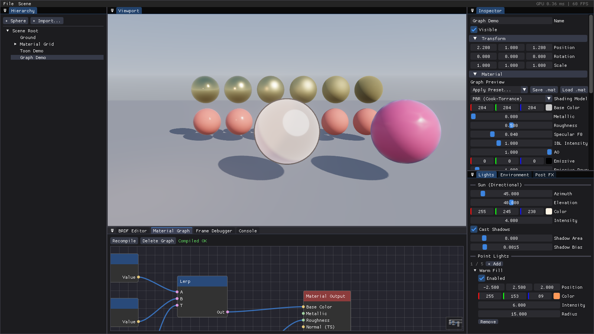

# Render Engine — PBR / NPR LookDev

一个基于 **OpenGL 4.5 + C++17** 的渲染引擎，面向角色 lookDev（如《绝区零》《明日方舟：终末地》风格的角色渲染），内置类 RenderDoc 的帧调试器。



## 功能

| 模块 | 说明 |
| --- | --- |
| 节点树场景 | 层级 Node（变换继承），Hierarchy 面板可选择/隐藏/删除节点 |
| 事件总线 | 类型化 pub/sub（窗口、按键、文件变更、Shader 重载、拖放等事件） |
| Shader 热重载 | 轮询文件时间戳，自动重编译；支持 `#include`，include 的文件（如 `brdf.glsl`）变更同样触发依赖它的 Shader 重载；编译失败保留旧程序并显示错误 |
| Cook-Torrance PBR | 金属度/粗糙度工作流，直接光 + IBL（辐照度图 + 预滤波镜面 + BRDF LUT，split-sum） |
| 可编辑 BRDF | ① UI 内直接切换 D/G/F 各项变体（GGX/Beckmann/Blinn-Phong、Smith 高度相关/Schlick-GGX/Implicit、Schlick/粗糙度 Schlick/无）；② 在 **BRDF Editor** 面板直接编辑 `assets/shaders/brdf.glsl` 源码，保存即热重载 |
| UE 式材质编辑 | **Material Graph** 面板：拖拽节点连线（右键添加节点），实时生成 GLSL 并编译；约 40 种节点：常量/数学/向量/纹理采样/UV（Tiling/Rotate/Panner）/工具（Fresnel/噪声/时间）/Toon（Ramp、SDF 面部阴影、Kajiya-Kay 各向异性发丝高光、风格化高光、边缘光、Matcap、次表面近似）；**Custom 代码节点**（UE Custom HLSL 式，节点内写函数体，内置 float2/3/4、lerp、saturate、frac、mul 等 HLSL 别名，可用 gN/gV/gUV/uTime 全局量，Apply 即重编译）；生成的 shader 落盘到 `assets/shaders/generated/` 可检视，参与热重载 |
| 材质资产 | 内置 11 种预设（PBR/金属/玻璃/皮肤/布料/自发光/Toon 皮肤·头发·布料等），Inspector 一键套用；材质（含节点图）可保存/加载为 JSON `.mat` 文件（`assets/materials/`） |
| NPR 卡通渲染 | 半兰伯特 ramp 双色调（支持 ramp 贴图）、风格化高光、边缘光；绝区零式反向壳描边独立 Pass（平滑法线外扩、像素级恒定宽度 + 世界空间钳制、深度偏移、可从底色/贴图派生描边色） |
| 光照 | 1 个太阳光（方位角/仰角、颜色、强度、PCF 阴影）+ 最多 5 个点光（位置、颜色、强度、半径） |
| IBL 环境 | 拖入 `.hdr` 全景图或使用内置程序化天空；可旋转、调强度、背景模糊 |
| 后处理 | MSAA 抗锯齿（2x/4x/8x，多重采样场景 RT + Resolve Pass）、物理 Bloom（13-tap 降采样 + Karis 平均 + tent 升采样）、ACES Filmic 色调映射（可切 Reinhard/None）、曝光 |
| 帧调试器 | 每个 Pass 注册输入纹理与输出 RT，可逐 Pass 查看；纹理检视器支持通道隔离（R/G/B/A）、范围重映射、Gamma、cubemap 逐面 + mip 查看；每 Pass GPU 耗时与 draw call 数 |
| 资产导入 | Assimp：FBX / OBJ / glTF / GLB / DAE / PMX(MMD)；贴图 PNG/JPG/TGA/BMP + 嵌入式贴图；直接把文件拖进窗口即可 |

## 构建（Windows）

需要：CMake ≥ 3.24、Ninja、Visual Studio Build Tools（MSVC）。首次构建会用 FetchContent 拉取 GLFW/GLEW/GLM/ImGui/Assimp/stb。

```bat
build.bat
build\render_engine.exe
```

支持 `--screenshot out.png [N]`：渲染 N 帧后保存窗口截图并退出（用于自动化回归）。

## 使用

- **相机**：视口内左键拖动 = 环绕，Shift+左键 / 中键 = 平移，滚轮 = 缩放
- **导入模型**：`File > Import Model...`，或直接把 FBX/GLTF/PMX 拖进窗口
- **角色 lookDev 流程**：导入模型 → 在 Inspector 里选中根节点 → `Set subtree -> Toon` 一键切卡通材质（含描边）→ 逐材质调 ramp 阈值/软度、边缘光、描边宽度；写实渲染则保持 PBR 并绑定金属度/粗糙度/法线贴图
- **环境**：把 `.hdr` 拖进窗口或在 Environment 面板加载（HDR 可从 Poly Haven 下载）
- **贴图**：选中节点后把图片拖进窗口 = 设为 albedo；或在材质的 Textures 槽位中逐张加载
- **调试**：Frame Debugger 面板选择 Pass → 点击输入/输出缩略图 → 用通道/范围/mip 控件检查（阴影贴图、IBL 立方体图、Bloom mip 链、HDR 场景色等）
- **改 BRDF**：BRDF Editor 面板改代码按 `Save && Recompile`，或用任意编辑器改 `assets/shaders/*.glsl`，保存立即生效
- **节点图材质**：选中节点 → Material Graph 面板 `Create Material Graph` → 右键画布添加节点 → 连线到 Material Output（连线即时重编译，出错红字提示且保留上一个可用 shader）；默认场景的 "Graph Demo" 球即示例图；Ctrl+点击可拔线，Delete 删除选中节点/连线
- **材质预设与保存**：Inspector 材质区顶部 `Apply Preset...` 套用预设（保留已绑贴图）；`Save .mat` / `Load .mat` 序列化整个材质（含节点图与贴图相对路径）

## 目录结构

```
assets/shaders/    全部 GLSL（可热重载；brdf.glsl 为 BRDF 模块；
                   graph_common.glsl 为节点图光照模板；generated/ 为图生成 shader）
assets/materials/  .mat 材质资产（JSON，含节点图）
src/core/          日志、事件总线、文件监视、窗口、应用主循环
src/scene/         节点树、相机、灯光、网格、材质
src/render/        Shader 库、纹理、FBO、IBL、Bloom、渲染器、帧调试器
src/material/      材质资产序列化、预设库、节点图、GLSL 代码生成、shader 缓存
src/import/        Assimp 模型导入
src/ui/            ImGui 编辑器面板（含 imnodes 节点图编辑器）
```
